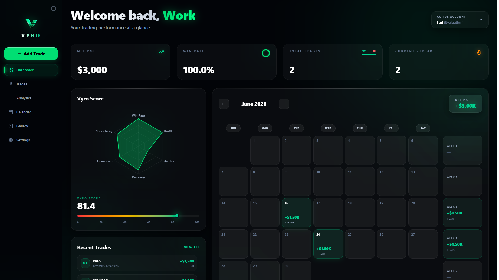
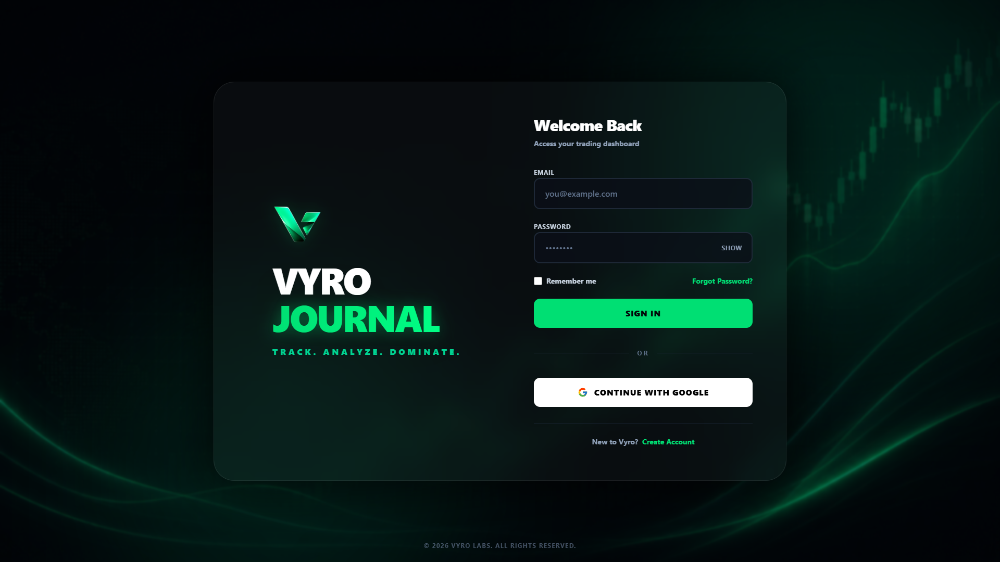

# 📈 Vyro

### *Trade Smarter. Improve Faster.*

A modern trading journal that helps traders **track performance**, **manage risk**, and **learn from every trade**.

---

**📸 Dashboard Preview**

---

# ✨ Overview

**Vyro** is a modern trading journal built to help traders become more consistent through data-driven decision making.

Instead of relying on spreadsheets or handwritten notes, Vyro provides a clean workspace where traders can log trades, analyze statistics, monitor performance, and continuously improve their trading strategy.

Whether you're a beginner or an experienced trader, Vyro helps transform trading history into actionable insights.

---

# 🚀 Features

### 📒 Trade Journal

* Log trades in seconds
* Store entry, stop loss, take profit, and notes
* Upload trade screenshots
* Organize trades by account and strategy

---

### 📊 Performance Analytics

* Win Rate
* Profit Factor
* Average Risk-to-Reward
* Equity Growth
* Performance Charts
* Trading Calendar

---

### 🛡️ Vyro Limiter *(Coming Soon)*

Protect your trading account with built-in risk management.

✔ Daily Loss Limit

✔ Maximum Trades Per Day

✔ Profit Lock

✔ Overtrading Prevention

✔ Capital Protection

---

### 🤖 AI Trading Coach *(Coming Soon)*

Analyze your trading history using AI.

The AI will:

* Detect recurring mistakes
* Identify emotional trading habits
* Find weak strategies
* Suggest improvements
* Help build trading discipline

---

### 🔄 Broker Integration *(Planned)*

Automatically sync trades from supported brokers without manual entry.

---

# 🖼 Screenshots

## Login

---

## Dashboard

---

## Analytics

---

## Trade History

## Gallery

---

# 🛠 Tech Stack

| Frontend     | Backend    | Database            | Authentication        |
| ------------ | ---------- | ------------------- | --------------------- |
| React        | Firebase   | Supabase PostgreSQL | Firebase Auth         |
| Tailwind CSS | JavaScript | SQL                 | Google Authentication |

---

# 📅 Roadmap

| Status | Feature            |
| ------ | ------------------ |
| ✅      | Authentication     |
| ✅      | Dashboard          |
| ✅      | Trade Journal      |
| ✅      | Analytics          |
| ✅     | Screenshot Upload  |
| 🚧     | Vyro Limiter       |
| ⏳      | AI Trading Coach   |
| ⏳      | Broker Integration |
| ⏳      | Mobile Support     |

---
# 🌟 Why Vyro?

Unlike a traditional trading journal, Vyro focuses on helping traders improve through analytics, discipline, and automation.

The long-term vision is to create an all-in-one platform combining:

* Trading Journal
* AI Coach
* Risk Management
* Broker Sync
* Performance Analytics

into one seamless experience.

---

# 📄 License

This project is intended for educational and portfolio purposes.

---

## 👨‍💻 Author

### **Toyakant Chaudhary**

*"Building secure, scalable, and modern web applications."*
